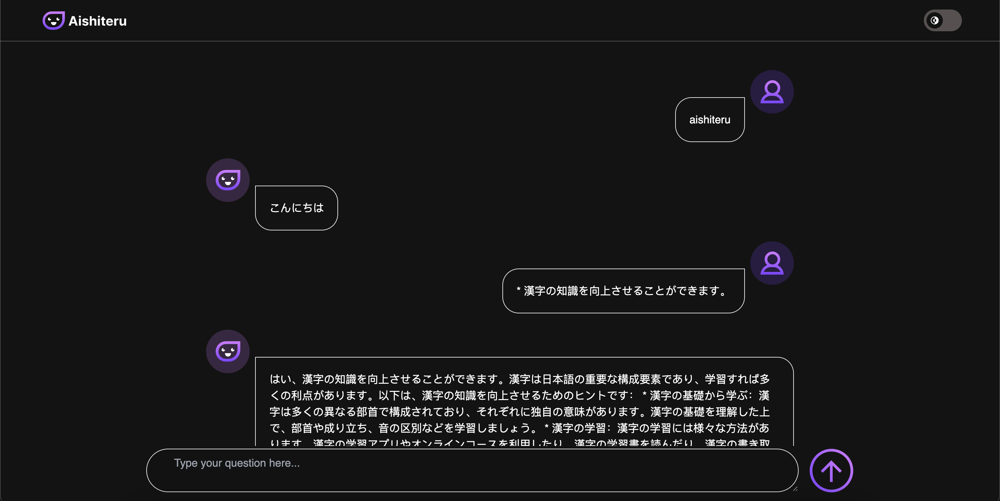

# Aishiteru chat




Aishiteru is a fun app that explores the new experimental feature of Chrome, the `window.ai` API.

## Overview of the `window.ai` API

The new API introduces six new functions:

1. **The `window.ai` object**:
    - `canCreateGenericSession` and `canCreateTextSession`: These functions check if you have everything needed to use these features. If the result is 'ready', then you're good to go.
    - `createGenericSession` and `createTextSession`: These functions are used to create sessions, from which you can use the model.
    - `defaultGenericSessionOptions` and `defaultTextSessionOptions`: These functions return the default options arguments for the `createGenericSession` and `createTextSession` functions.

## How to Get It?

The API is currently available only on the latest build of Chrome Canary. You can use Chrome for developers [here](https://www.google.com/chrome/dev/). Additionally, it's hidden behind a few internal Chrome flags.

### Steps to Enable

1. **Enable the "Prompt API for Gemini Nano" flag**:
    - You can find this flag here: `chrome://flags/#prompt-api-for-gemini-nano`
    - Enable the flag.

2. **Turn on the "Enable optimization guide on device" flag**:
    - This flag is located at `chrome://flags/#optimization-guide-on-device-model`
    - Make sure to choose "Enabled BypassPerfRequirement".

3. **Install the Chrome component**:
    - Go to `chrome://components/` and install the "Optimization Guide On Device Model" Chrome component by clicking the "Check for update" button.

## Running the Project

After setting up your browser, you can run this project using Yarn.

### Prerequisites for Aishiteru

- Make sure you have the correct versions of Yarn and Node.js:
    - Node.js: v20.10.0
    - Yarn: 1.22.19

### Installation

1. Install the node modules:
    ```bash
    yarn install
    ```

2. Run the server:
    ```bash
    yarn dev
    ```
